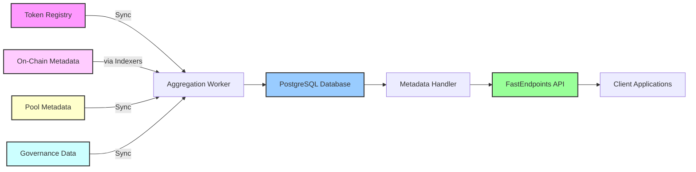

<div align="center">
    
  <h1>Cardano Open Metadata Project (COMP)</h1>
  <p><strong>Comprehensive Metadata Service for the Cardano Blockchain</strong></p>
  
  <a href="https://github.com/SAIB-Inc/COMP/fork">
    
  </a>
  <a href="https://github.com/SAIB-Inc/COMP/stargazers">
    
  </a>
  <a href="https://github.com/SAIB-Inc/COMP/graphs/contributors">
    
  </a>
  <a href="https://github.com/SAIB-Inc/Chrysalis">
    
  </a>
  <a href="https://github.com/SAIB-Inc/Argus">
    
  </a>
  <br>
  <a href="https://dotnet.microsoft.com/download">
    
  </a>
  <a href="https://www.postgresql.org/">
    
  </a>
  <a href="https://cardano.org/">
    
  </a>
</div>

## 📖 Overview

The Cardano Open Metadata Project (COMP) is a unified metadata specification and high-performance reference implementation for the Cardano blockchain. COMP defines standardized REST APIs that aggregate all Cardano metadata types - tokens, NFTs, stake pools, and DReps - from multiple sources into a single, queryable interface. Built with modern .NET 9.0 and PostgreSQL, our reference implementation demonstrates sub-millisecond query performance while establishing COMP as the definitive metadata standard for the Cardano ecosystem.

**Key Features:**

- 🔄 **Multi-Source Aggregation** - Unifies metadata from token registry, on-chain data, stake pools, and DReps
- ⚡ **High-Performance APIs** - Sub-millisecond response times with optimized queries
- 🔍 **Universal Search** - Full-text search across all metadata types (tokens, NFTs, pools, DReps)
- 📦 **Batch Operations** - Retrieve metadata for multiple assets in a single request
- 🎯 **Smart Filtering** - Filter by policy ID, metadata type, and custom criteria
- 📊 **Pagination Support** - Efficient handling of large result sets
- 🏷️ **CIP Standards Support** - Compatible with CIP-25 (NFTs), CIP-68 (datums), and other metadata standards
- 🔧 **Built on Proven Libraries** - Leverages [Chrysalis](https://github.com/SAIB-Inc/Chrysalis) (C# serialization) and [Argus](https://github.com/SAIB-Inc/Argus) (blockchain indexer)

## 🏗️ Architecture

### System Components



### Core Modules

| Component | Description | Responsibility |
|-----------|-------------|----------------|
| **Aggregation Worker** | Background service | Syncs metadata from all sources (tokens, NFTs, pools, DReps) |
| **Source Services** | API clients | Handles integration with various metadata sources |
| **MetadataDbService** | Database layer | Manages all metadata persistence and queries |
| **MetadataHandler** | Business logic | Implements querying logic with advanced filtering |
| **API Endpoints** | REST endpoints | Exposes unified metadata through standardized APIs |

## 🚀 Quick Start

### Prerequisites

- .NET 9.0 SDK
- PostgreSQL 15+
- GitHub Personal Access Token (for API rate limits)

### Installation

1. **Clone the repository**
```bash
git clone https://github.com/SAIB-Inc/COMP.git
cd COMP
```

2. **Configure application settings**
```json
{
  "ConnectionStrings": {
    "DefaultConnection": "Host=localhost;Database=cardano_metadata;Username=postgres;Password=yourpassword"
  },
  "GithubPAT": "your_github_personal_access_token",
  "RegistryOwner": "cardano-foundation",
  "RegistryRepo": "cardano-token-registry",
  "Github": {
    "UserAgent": {
      "ProductName": "CardanoMetadataService",
      "ProductUrl": "(+https://github.com/SAIB-Inc/COMP)"
    }
  }
}
```

3. **Run database migrations**
```bash
dotnet ef database update
```

4. **Start the service**
```bash
dotnet run
```

The service will start syncing with the GitHub Token Registry and expose APIs on:
- `https://localhost:7276` (HTTPS) or `http://localhost:5146` (HTTP)

## 📡 API Endpoints

### Get Single Asset Metadata

Retrieve metadata for a specific asset (token, NFT, or other) by its subject.

```http
GET /metadata/{subject}
```

**Parameters:**
- `subject` - The token subject (format: `{policyId}{assetName}`)

**Example Request:**
```bash
curl https://localhost:7276/metadata/789ef8ae89617f34c07f7f6a12e4d65146f958c0bc15a97b4ff169f16861707079636f696e
```

**Example Response:**
```json
{
  "subject": "789ef8ae89617f34c07f7f6a12e4d65146f958c0bc15a97b4ff169f16861707079636f696e",
  "name": "HOSKY Token",
  "ticker": "HOSKY",
  "policyId": "789ef8ae89617f34c07f7f6a12e4d65146f958c0bc15a97b4ff169f1",
  "decimals": 0,
  "policy": "https://hosky.io",
  "url": "https://hosky.io",
  "logo": "iVBORw0KGgoAAAANSUhEUgAA...",
  "description": "The first and onlyRugPull on Cardano"
}
```

### Batch Metadata Query

Retrieve metadata for multiple assets with advanced filtering options.

```http
POST /metadata
```

**Request Body:**
```json
{
  "subjects": [
    "subject1",
    "subject2"
  ],
  "limit": 50,
  "offset": 0,
  "searchText": "ADA",
  "policyId": "789ef8ae89617f34c07f7f6a12e4d65146f958c0bc15a97b4ff169f1",
  "policy": "https://example.com",
  "includeEmptyName": false,
  "includeEmptyLogo": false,
  "includeEmptyTicker": false
}
```

**Parameters:**
| Parameter | Type | Description |
|-----------|------|-------------|
| `subjects` | string[] | List of asset subjects to query |
| `limit` | int? | Maximum number of results (pagination) |
| `offset` | int? | Number of results to skip (pagination) |
| `searchText` | string? | Search across name, description, and ticker |
| `policyId` | string? | Filter by specific policy ID |
| `policy` | string? | Filter by policy URL |
| `includeEmptyName` | bool? | Include assets without names (default: false) |
| `includeEmptyLogo` | bool? | Include assets without logos (default: false) |
| `includeEmptyTicker` | bool? | Include assets without tickers (default: false) |

**Example Response:**
```json
{
  "total": 150,
  "data": [
    {
      "subject": "subject1",
      "name": "Token Name",
      "ticker": "TKN",
      "policyId": "policyId",
      "decimals": 6,
      "policy": "https://policy.url",
      "url": "https://token.url",
      "logo": "base64_image_data",
      "description": "Token description"
    }
  ]
}
```

## 🔄 Synchronization Architecture

The COMP specification defines a robust synchronization architecture that:

### Data Aggregation
- **Multi-Source Integration** - Aggregates from token registries, on-chain data, pool metadata, and governance sources
- **Real-time Updates** - Monitors and processes changes across all metadata sources
- **Data Normalization** - Standardizes different metadata formats into unified schema
- **Conflict Resolution** - Handles updates from multiple sources with priority rules

### Implementation Requirements
- **Incremental Sync** - Support for efficient delta updates
- **Error Recovery** - Automatic retry mechanisms for failed synchronizations
- **State Management** - Track synchronization status per source
- **Data Validation** - Verify metadata integrity before storage

## 🛠️ Technical Specifications

### Performance Requirements

- **Query Response Time** - Sub-millisecond for single asset lookups
- **Batch Processing** - Support for querying 100+ assets in single request
- **Search Performance** - Full-text search across millions of metadata entries

- **Data Freshness** - Maximum 1-minute delay for metadata updates


### Metadata Types Supported

- **Native Tokens** - Fungible token and NFT metadata from registries
- **CIP-25** - NFT metadata standard
- **CIP-68** - Reference NFT standard with datum metadata
- **Stake Pools** - Pool metadata, performance metrics, and delegation info
- **Governance/DReps** - Delegated representative profiles, proposals, and voting data
- **Transaction Metadata** - Custom metadata attached to transactions

### Error Handling Standards

COMP implementations must handle:

- **Network Resilience** - Retry mechanisms with exponential backoff
- **Data Validation** - Reject malformed metadata without breaking sync
- **Rate Limiting** - Respect source API limits and implement throttling
- **Concurrency** - Handle simultaneous updates without data corruption
- **Graceful Degradation** - Continue operating with partial source availability

## 📦 Reference Implementation Stack

Our reference implementation demonstrates the COMP specification using:

### Core Technologies
- **.NET 9.0** - High-performance runtime with modern C# features
- **PostgreSQL** - Scalable database for metadata storage
- **FastEndpoints** - Lightweight API framework for REST endpoints

### Integration Libraries
- **[Chrysalis](https://github.com/SAIB-Inc/Chrysalis)** - Cardano serialization library for C#
- **[Argus](https://github.com/SAIB-Inc/Argus)** - Blockchain indexer for on-chain metadata
- **Entity Framework Core** - Data access layer
- **LinqKit** - Dynamic query composition

## 🧪 Testing & Validation

Implementations of COMP should include:

- **Unit Tests** - Test individual components and data transformations
- **Integration Tests** - Verify end-to-end metadata flow
- **Performance Tests** - Validate response time requirements
- **Load Tests** - Ensure system handles concurrent requests
- **Data Validation** - Verify metadata accuracy and completeness

## 🚢 Deployment Guidelines

COMP implementations should support:

### Configuration Management
- **Environment Variables** - Secure configuration for production
- **Connection Strings** - Database and external service connections
- **API Keys** - Authentication for metadata sources
- **Feature Flags** - Enable/disable specific metadata types

### Infrastructure Requirements
- **Horizontal Scaling** - Support for multiple instances
- **Load Balancing** - Distribute requests across instances
- **Database Replication** - Read replicas for query performance

## 📊 Monitoring & Observability

### Required Health Checks
- **Service Health** - Overall system status endpoint
- **Database Connectivity** - Connection pool and query health
- **Source Availability** - Status of each metadata source
- **Sync Status** - Last successful sync per source

### Key Metrics
- **API Latency** - Response times
- **Throughput** - Requests per second by endpoint
- **Error Rates** - Failed requests and sync errors
- **Data Freshness** - Time since last update per metadata type

## 🔒 Security Requirements

COMP implementations must include:

- **Rate Limiting** - Configurable limits per client/endpoint
- **Input Validation** - Sanitize and validate all user inputs
- **Secrets Management** - Secure storage for credentials and keys
- **CORS Policy** - Configure appropriate cross-origin policies

## 🤝 Contributing

We welcome contributions! Please follow these steps:

1. Fork the repository
2. Create a feature branch: `git checkout -b feature/amazing-feature`
3. Commit your changes: `git commit -m 'feat: add amazing feature'`
4. Push to the branch: `git push origin feature/amazing-feature`
5. Open a Pull Request

### Development Guidelines
- Follow C# coding conventions
- Write unit tests for new features
- Update documentation as needed
- Ensure all tests pass before submitting PR

---

<div align="center">
  <p>Built with ❤️ by <a href="https://saib.dev">SAIB Inc</a> for the Cardano ecosystem</p>
  <p>
    <a href="https://github.com/SAIB-Inc/COMP/issues">Report Bug</a> •
    <a href="https://github.com/SAIB-Inc/COMP/issues">Request Feature</a> •
    <a href="https://docs.cardano.metadata.dev">Documentation</a>
  </p>
</div>