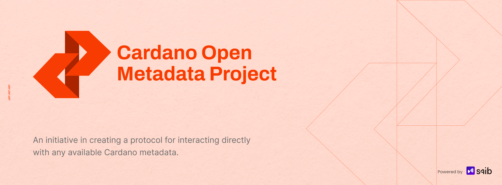
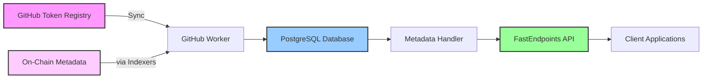

<div align="center">
    
  <h1>Cardano Open Metadata Project (COMP)</h1>
  <p><strong>Comprehensive Metadata Service for the Cardano Blockchain</strong></p>
  
  <a href="https://github.com/SAIB-Inc/COMP/fork">
    
  </a>
  <a href="https://github.com/SAIB-Inc/COMP/stargazers">
    
  </a>
  <a href="https://github.com/SAIB-Inc/COMP/graphs/contributors">
    
  </a>
  <br>
  <a href="https://dotnet.microsoft.com/download">
    
  </a>
  <a href="https://www.postgresql.org/">
    
  </a>
  <a href="https://cardano.org/">
    
  </a>
</div>

## 📖 Overview

The Cardano Open Metadata Project (COMP) is a high-performance synchronization and API service that provides instant access to all types of Cardano blockchain metadata. It aggregates metadata from multiple sources including the [Cardano Token Registry](https://github.com/cardano-foundation/cardano-token-registry), on-chain metadata, NFT metadata, and other Cardano metadata standards, exposing everything through blazing-fast REST APIs with advanced querying capabilities.

**Key Features:**

- 🔄 **Multi-Source Synchronization** - Aggregates metadata from token registry, on-chain data, and other sources
- ⚡ **High-Performance APIs** - Sub-millisecond response times with optimized queries
- 🔍 **Universal Search** - Full-text search across all metadata types (tokens, NFTs, pools, etc.)
- 📦 **Batch Operations** - Retrieve metadata for multiple assets in a single request
- 🎯 **Smart Filtering** - Filter by policy ID, metadata type, and custom criteria
- 📊 **Pagination Support** - Efficient handling of large result sets
- 🏷️ **CIP Standards Support** - Compatible with CIP-25 (NFTs), CIP-68 (datums), and other metadata standards

## 🏗️ Architecture

### System Components



### Core Modules

| Component | Description | Responsibility |
|-----------|-------------|----------------|
| **GithubWorker** | Background service | Syncs metadata from GitHub registry and other sources |
| **GithubService** | GitHub API client | Handles API calls to fetch commits, trees, and raw files |
| **MetadataDbService** | Database layer | Manages all metadata persistence and queries |
| **MetadataHandler** | Business logic | Implements querying logic with advanced filtering |
| **API Endpoints** | REST endpoints | Exposes metadata through GET and POST endpoints |

## 🚀 Quick Start

### Prerequisites

- .NET 9.0 SDK
- PostgreSQL 15+
- GitHub Personal Access Token (for API rate limits)

### Installation

1. **Clone the repository**
```bash
git clone https://github.com/SAIB-Inc/COMP.git
cd COMP
```

2. **Configure application settings**
```json
{
  "ConnectionStrings": {
    "DefaultConnection": "Host=localhost;Database=cardano_metadata;Username=postgres;Password=yourpassword"
  },
  "GithubPAT": "your_github_personal_access_token",
  "RegistryOwner": "cardano-foundation",
  "RegistryRepo": "cardano-token-registry",
  "Github": {
    "UserAgent": {
      "ProductName": "CardanoMetadataService",
      "ProductUrl": "(+https://github.com/SAIB-Inc/COMP)"
    }
  }
}
```

3. **Run database migrations**
```bash
dotnet ef database update
```

4. **Start the service**
```bash
dotnet run
```

The service will start syncing with the GitHub Token Registry and expose APIs on:
- `https://localhost:7276` (HTTPS) or `http://localhost:5146` (HTTP)

## 📡 API Endpoints

### Get Single Asset Metadata

Retrieve metadata for a specific asset (token, NFT, or other) by its subject.

```http
GET /metadata/{subject}
```

**Parameters:**
- `subject` - The token subject (format: `{policyId}{assetName}`)

**Example Request:**
```bash
curl https://localhost:7276/metadata/789ef8ae89617f34c07f7f6a12e4d65146f958c0bc15a97b4ff169f16861707079636f696e
```

**Example Response:**
```json
{
  "subject": "789ef8ae89617f34c07f7f6a12e4d65146f958c0bc15a97b4ff169f16861707079636f696e",
  "name": "HOSKY Token",
  "ticker": "HOSKY",
  "policyId": "789ef8ae89617f34c07f7f6a12e4d65146f958c0bc15a97b4ff169f1",
  "decimals": 0,
  "policy": "https://hosky.io",
  "url": "https://hosky.io",
  "logo": "iVBORw0KGgoAAAANSUhEUgAA...",
  "description": "The first and onlyRugPull on Cardano"
}
```

### Batch Metadata Query

Retrieve metadata for multiple assets with advanced filtering options.

```http
POST /metadata
```

**Request Body:**
```json
{
  "subjects": [
    "subject1",
    "subject2"
  ],
  "limit": 50,
  "offset": 0,
  "searchText": "ADA",
  "policyId": "789ef8ae89617f34c07f7f6a12e4d65146f958c0bc15a97b4ff169f1",
  "policy": "https://example.com",
  "includeEmptyName": false,
  "includeEmptyLogo": false,
  "includeEmptyTicker": false
}
```

**Parameters:**
| Parameter | Type | Description |
|-----------|------|-------------|
| `subjects` | string[] | List of asset subjects to query |
| `limit` | int? | Maximum number of results (pagination) |
| `offset` | int? | Number of results to skip (pagination) |
| `searchText` | string? | Search across name, description, and ticker |
| `policyId` | string? | Filter by specific policy ID |
| `policy` | string? | Filter by policy URL |
| `includeEmptyName` | bool? | Include assets without names (default: false) |
| `includeEmptyLogo` | bool? | Include assets without logos (default: false) |
| `includeEmptyTicker` | bool? | Include assets without tickers (default: false) |

**Example Response:**
```json
{
  "total": 150,
  "data": [
    {
      "subject": "subject1",
      "name": "Token Name",
      "ticker": "TKN",
      "policyId": "policyId",
      "decimals": 6,
      "policy": "https://policy.url",
      "url": "https://token.url",
      "logo": "base64_image_data",
      "description": "Token description"
    }
  ]
}
```

## 🔄 Synchronization Process

### Initial Synchronization

When the service starts for the first time:

1. **Fetches Latest Commit** - Gets the most recent commit from all configured sources
2. **Downloads Full Tree** - Retrieves the complete file tree recursively
3. **Processes All Metadata** - Parses JSON files, on-chain data, and external sources
4. **Stores Metadata** - Saves all valid metadata to PostgreSQL
5. **Records Sync State** - Saves the commit hash and timestamp for each source

### Incremental Synchronization

After initial sync, the service:

1. **Checks for New Data** - Polls for new commits and on-chain updates
2. **Processes Changes** - Only updates modified metadata entries
3. **Handles All Operations** - Intelligently adds, updates, or removes metadata
4. **Updates Sync State** - Records the latest processed state for each source

**Sync Interval:** 1 minute between cycles  
**Error Recovery:** 30-second retry on failures

## 🛠️ Technical Details

### Database Schema

#### TokenMetadata Table
```sql
CREATE TABLE "TokenMetadata" (
    "Subject" TEXT PRIMARY KEY,
    "Name" TEXT NOT NULL,
    "Ticker" TEXT NOT NULL,
    "PolicyId" TEXT NOT NULL,
    "Decimals" INTEGER NOT NULL,
    "Policy" TEXT,
    "Url" TEXT,
    "Logo" TEXT,
    "Description" TEXT
);

CREATE INDEX "IX_TokenMetadata_Name_Description_Ticker" 
ON "TokenMetadata" ("Name", "Description", "Ticker");
```

#### SyncState Table
```sql
CREATE TABLE "SyncState" (
    "Hash" TEXT PRIMARY KEY,
    "Date" TIMESTAMPTZ NOT NULL
);
```

### Performance Optimizations

- **Database Context Factory** - Efficient context lifecycle management
- **AsNoTracking Queries** - Read-only queries without change tracking
- **Dynamic Predicate Building** - Optimized query construction with LinqKit
- **Batch Deduplication** - Automatic removal of duplicate subjects
- **PostgreSQL ILIKE** - Native case-insensitive pattern matching
- **Indexed Columns** - Strategic indexing for search performance

### Metadata Types Supported

- **Native Tokens** - FT and NFT metadata from token registry
- **CIP-25** - NFT metadata standard
- **CIP-68** - Reference NFT standard with datum metadata
- **Pool Metadata** - Stake pool information
- **DApp Metadata** - Decentralized application metadata
- **Transaction Metadata** - Custom metadata attached to transactions
- **Off-chain Metadata** - IPFS, Arweave, and other storage solutions

### Error Handling

The service implements comprehensive error handling:

- **Network Failures** - Automatic retry with exponential backoff
- **Malformed Data** - Individual errors don't break the sync
- **API Rate Limits** - Respects limits with proper authentication
- **Database Conflicts** - Handles concurrent updates gracefully
- **Invalid Data** - Validates all metadata before persistence

## 📦 Dependencies

### Core Framework
- **.NET 9.0** - Latest LTS version with performance improvements
- **ASP.NET Core** - Web framework for hosting APIs

### Key Libraries
- **FastEndpoints 5.31.0** - Lightweight, high-performance API framework
- **Entity Framework Core 9.0** - Modern ORM with PostgreSQL support
- **Npgsql 9.0.4** - High-performance PostgreSQL driver
- **LinqKit 9.0.8** - Dynamic LINQ query building
- **Scalar 1.2.19** - API documentation UI

### Development Tools
- **Microsoft.CodeAnalysis** - Roslyn compiler platform
- **EF Core Design Tools** - Database migrations and scaffolding

## 🧪 Testing

### Running Tests
```bash
dotnet test
```

### Integration Testing
The service can be tested using the provided Swagger/Scalar UI:

1. Navigate to `https://localhost:7276/swagger` (Development mode)
2. Test endpoints directly from the browser
3. View request/response examples

## 🚢 Deployment

### Environment Variables
```bash
# Database
ConnectionStrings__DefaultConnection=Host=postgres;Database=cardano_metadata;Username=user;Password=pass

# GitHub Configuration
GithubPAT=ghp_xxxxxxxxxxxxxxxxxxxx
RegistryOwner=cardano-foundation
RegistryRepo=cardano-token-registry

# ASP.NET Core
ASPNETCORE_ENVIRONMENT=Production
```

## 📊 Monitoring

### Health Checks
Monitor service health through:
- Database connectivity status
- GitHub API availability
- Sync state freshness
- API response times

### Metrics
Key metrics to track:
- Tokens synchronized per minute
- API request latency (p50, p95, p99)
- Database query performance
- GitHub API rate limit usage

## 🔒 Security Considerations

- **API Authentication** - Currently public; implement API keys for production
- **Rate Limiting** - Add rate limiting to prevent abuse
- **Input Validation** - All inputs are validated and sanitized
- **SQL Injection** - Protected through Entity Framework parameterization
- **Secrets Management** - Use Azure Key Vault or similar for production

## 🗺️ Roadmap

- [ ] **Extended Metadata Support** - Add support for NFT metadata, pool metadata, and transaction metadata (currently only token registry)
- [ ] **API Rate Limiting** - Add rate limiting to protect the service
- [ ] **Response Caching** - Cache frequently requested metadata
- [ ] **API Authentication** - Simple API key authentication
- [ ] **Health Checks** - Add /health endpoint for monitoring
- [ ] **Performance Metrics** - Basic request/response metrics

## 🤝 Contributing

We welcome contributions! Please follow these steps:

1. Fork the repository
2. Create a feature branch: `git checkout -b feature/amazing-feature`
3. Commit your changes: `git commit -m 'feat: add amazing feature'`
4. Push to the branch: `git push origin feature/amazing-feature`
5. Open a Pull Request

### Development Guidelines
- Follow C# coding conventions
- Write unit tests for new features
- Update documentation as needed
- Ensure all tests pass before submitting PR


## 🙏 Acknowledgments

- [Cardano Foundation](https://cardanofoundation.org/) for maintaining the token registry
- [FastEndpoints](https://fast-endpoints.com/) for the excellent API framework
- The Cardano community for continuous support

---

<div align="center">
  <p>Built with ❤️ by <a href="https://saib.dev">SAIB Inc</a> for the Cardano ecosystem</p>
  <p>
    <a href="https://github.com/SAIB-Inc/COMP/issues">Report Bug</a> •
    <a href="https://github.com/SAIB-Inc/COMP/issues">Request Feature</a> •
    <a href="https://docs.cardano.metadata.dev">Documentation</a>
  </p>
</div>